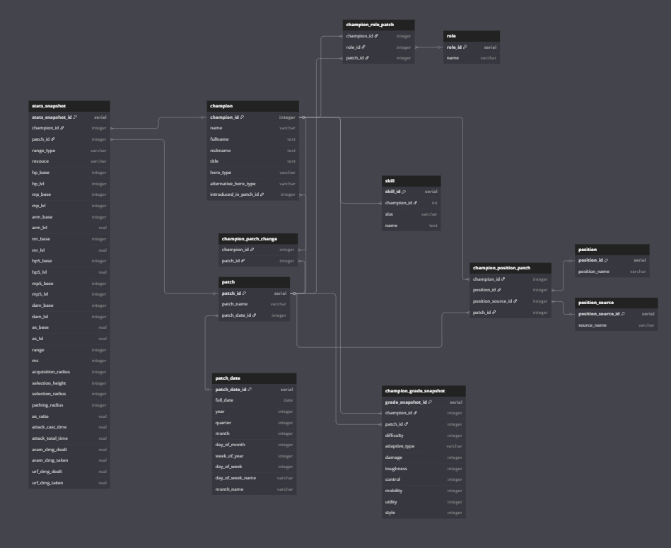

# League of Legends Champion Analytics

Power BI report analyzing champion statistics and release history 
across patches, built on a custom PostgreSQL database with a 
Python ETL pipeline.

## Tech stack
- **PostgreSQL** — relational database with 10+ tables
- **Python / Jupyter** — ETL pipeline for loading patch data
- **Power BI** — 5-page interactive report
- **DAX** — custom measures for time intelligence and rankings

## Report pages
1. Champion release history — roster growth over time
2. Base stats comparison — HP, damage, speed, range across patches
3. Roles and positions — meta distribution
4. Difficulty ratings — heatmap and scatter analysis
5. Champion card — full profile for a selected champion

## Database schema

## Data source
Champion data scraped from the official League of Legends wiki.
https://www.kaggle.com/code/laurenainsleyhaines/25-11-league-of-legends-champion-data-exracter
